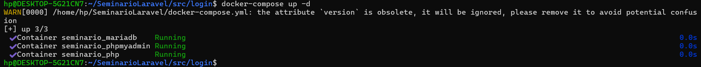
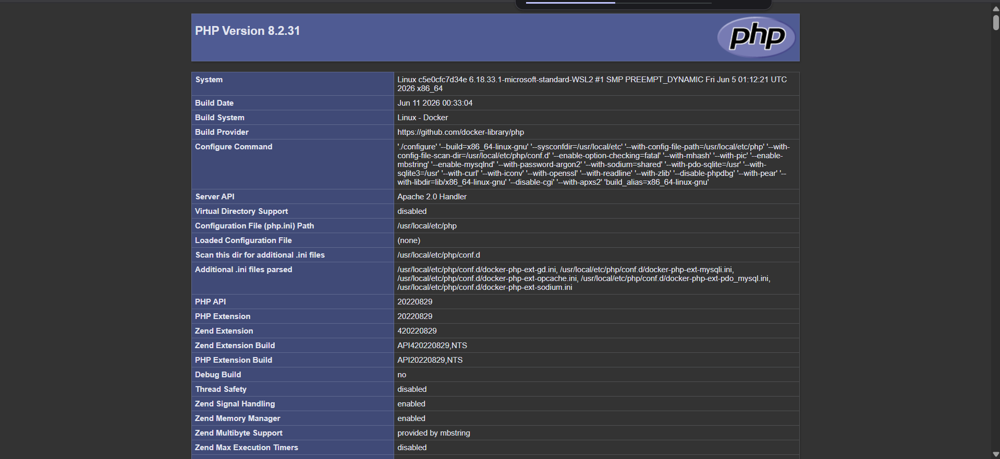
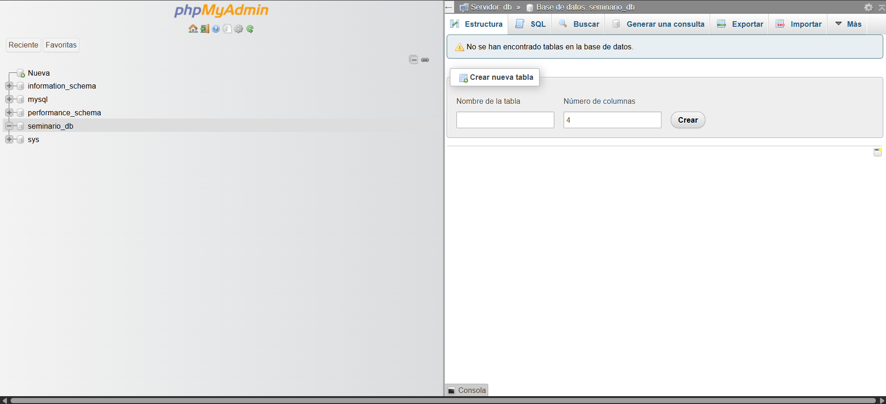
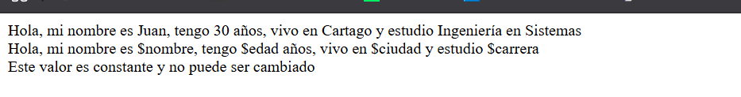
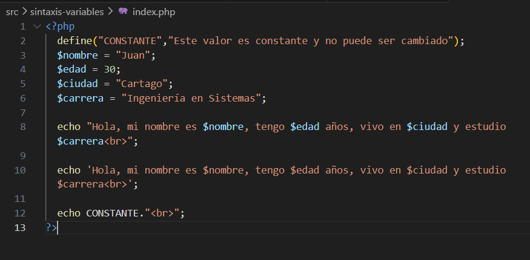

# 1. Suba este repositorio a tu cuenta de GitHub (público, agregando al docente
como colaborador).
# 2. Toma una captura de pantalla donde se vea:
o La terminal mostrando docker-compose up -d exitoso.

o El navegador en http://localhost:8080 mostrando el phpinfo().

o El navegador en http://localhost:8081 mostrando el login de
phpMyAdmin.

# 3. Agregar las capturas al informe del seminario (proyecto de grado) en la sección
"Configuración del entorno de desarrollo"
# Pagina http://localhost:8080/sintaxis-variables/

## codigo
