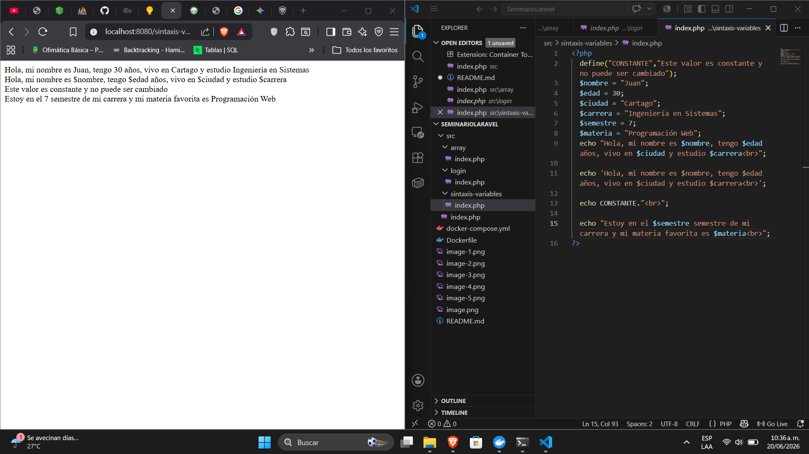
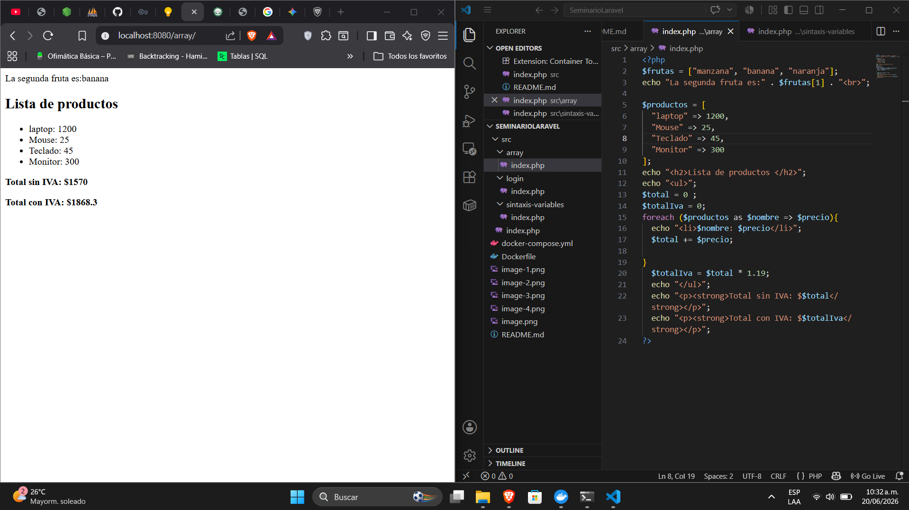
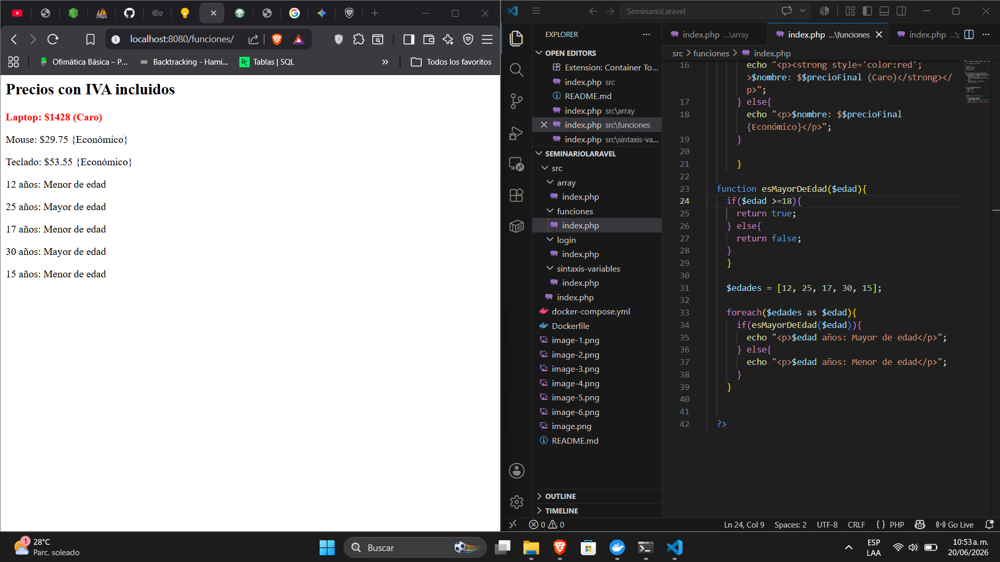
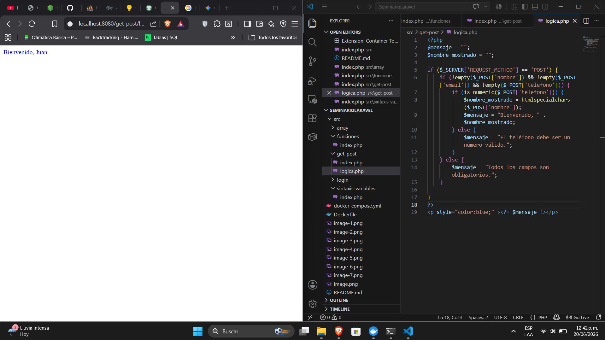
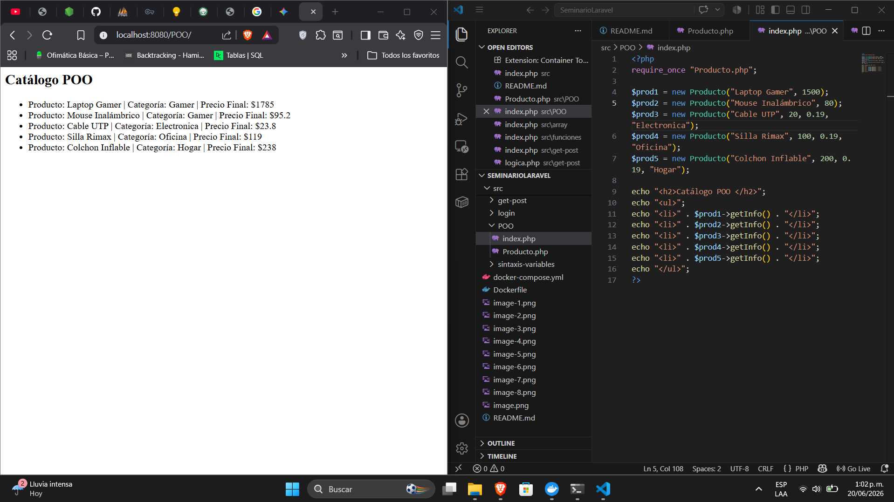
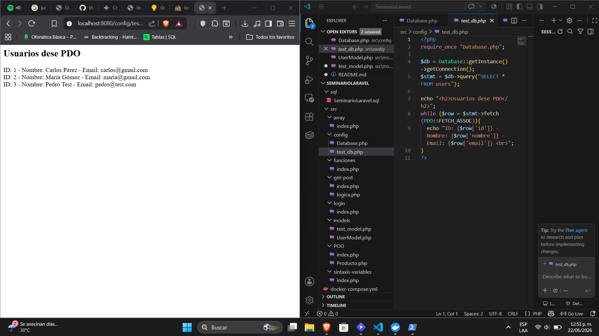
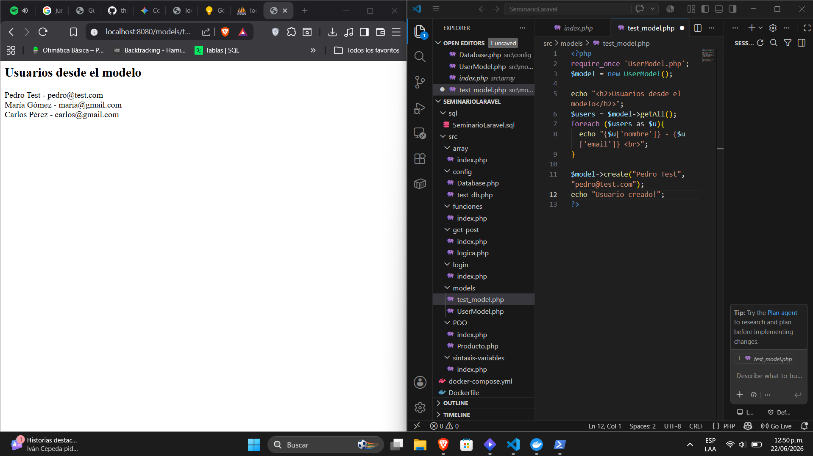
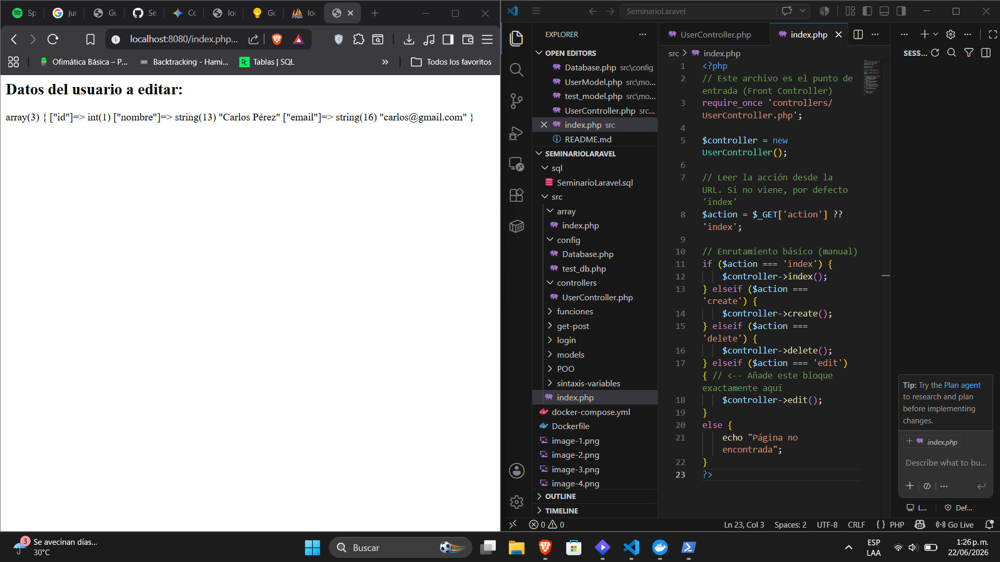
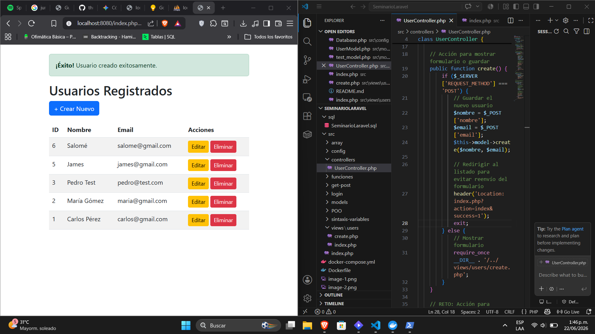

# 1. Suba este repositorio a tu cuenta de GitHub (público, agregando al docente
como colaborador).
# 2. Toma una captura de pantalla donde se vea:
o La terminal mostrando docker-compose up -d exitoso.

o El navegador en http://localhost:8080 mostrando el phpinfo().

o El navegador en http://localhost:8081 mostrando el login de
phpMyAdmin.

# 3. Agregar las capturas al informe del seminario (proyecto de grado) en la sección
# Actividad 1
## Pagina http://localhost:8080/sintaxis-variables/

# Actividad 2

# Actividad 3

# Axtividad 4

# Actividad 5

# Actividad 6

# Actividad 7

# Actividad 8

# Actividad 9

## Estructura del Proyecto

La arquitectura del proyecto está organizada de la siguiente manera:

* **`index.php` (Enrutador Frontal):** Actúa como el punto de entrada único de la aplicación. Captura los parámetros `$_GET['action']` y redirige el flujo al controlador correspondiente.
* **Modelos (`/models`):** Contiene la lógica de negocio y las consultas a la base de datos (por ejemplo, `UserModel.php`). Se encarga de las operaciones CRUD (Select, Insert, Delete).
* **Controladores (`/controllers`):** Intermediario entre el Modelo y la Vista (por ejemplo, `UserController.php`). Recibe las peticiones del usuario, interactúa con el modelo para obtener o modificar datos y carga la vista final.
* **Vistas (`/views`):** Archivos que contienen el código HTML y Bootstrap encargado de mostrar la interfaz al usuario final (ej. la lista de usuarios y el formulario de creación).